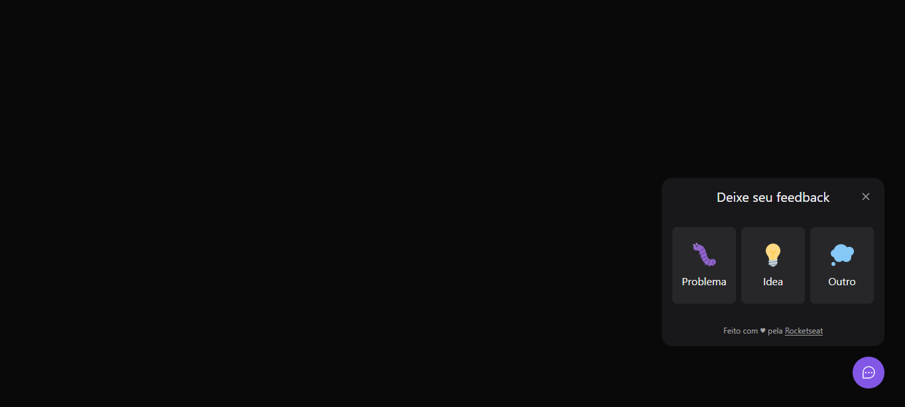

# Next Level Week Return

  
  
  

Projeto desenvolvido durante a Next Level Week Return de 05/2022 

## web

### config

Run `npm install` to install project dependenies

Run `npm run dev` to start development server

### links uteis

 - [React](https://reactjs.org/)
 - [Vite](https://vitejs.dev/)
 - [Typescript](https://www.typescriptlang.org/)
 - [Tailwind](https://tailwindcss.com/)
 - [Tailwind Forms](https://github.com/tailwindlabs/tailwindcss-forms)
 - [Tailwind ScroolBar](https://www.npmjs.com/package/tailwind-scrollbar)
 - [Phosphor Icons](https://github.com/phosphor-icons/phosphor-home)
 - [headless ui](https://headlessui.dev/)
 - [html2canva](https://html2canvas.hertzen.com/)

### comandos utilizados

 - `npm create vite@latest`
 - `npx tailwindcss init -p`
 - `npm install -D @tailwindcss/forms`
 - `npm install --save-dev tailwind-scrollbar`
 - `npm install phosphor-react`
 - `npm install @headlessui/react`
 - `npm install html2canvas`

## server
### config

Run `npm install` to install project dependenies

Run `npm run dev` to start development server

### links uteis

 - [Typescript](https://www.typescriptlang.org/)
 - [Express](https://expressjs.com/)
 - [Prisma](https://www.prisma.io/)
 - [NodeMailer](https://nodemailer.com/about/)
 - [Jest](https://jestjs.io/pt-BR/)
 - [swc](https://swc.rs/)
 - [Cors](https://www.npmjs.com/package/cors)

### comandos utilizados

 - `npm init -y`
 - `npm i typescript @types/node ts-node-dev -O`
 - `npx tsc --init`
 - `npx tsc`
 - `npm i express`
 - `npm i -D @types/express`
 - `npm install html2canvas`
 - `npm i prisma -D`
 - `npm i @prisma/client`
 - `npx prisma init`
 - `npx prisma migrate dev`
 - `npx prisma migrate deploy`
 - `npx prisma studio`
 - `npm install nodemailer`
 - `npm install @types/nodemailer`
 - `npm install jest -D`
 - `npx jest --init`
 - `npm install ts-node -D`
 - `npm i @types/jest -D`
 - `npm i -D jest @swc/jest`
 - `npm i cors`
 - `npm i @types/ cors -D`

## mobile

### config

Run `npm install` to install project dependenies

Run `expo start` to start development server

### links uteis

 - [Typescript](https://www.typescriptlang.org/)
 - [Expo](https://expo.dev/)
 - [Phosphor react native](https://phosphoricons.com/)
 - [Bottom sheet](https://gorhom.github.io/react-native-bottom-sheet/)
 - [Axios](https://axios-http.com/ptbr/docs/intro)
 

### comandos utilizados

 - `expo init mobile`
 - `npm install -g expo-cli`
 - `expo install expo-font @expo-google-fonts/inter`
 - `expo install expo-app-loading`
 - `npm install --save phosphor-react-native `
 - `expo install react-native-svg`
 - `npm install react-native-iphone-x-helper`
 - `expo install @gorhom/bottom-sheet@^4`
 - `expo install react-native-reanimated`
 - `expo install react-native-gesture-handler`
 - `expo install react-native-view-shot`
 - `npm install axios`
 - `expo install expo-file-system`

 

---

Desenvolvido Por [Alessandro Massarotti Jr](https://github.com/alessandro-massarotti-jr) 🤖